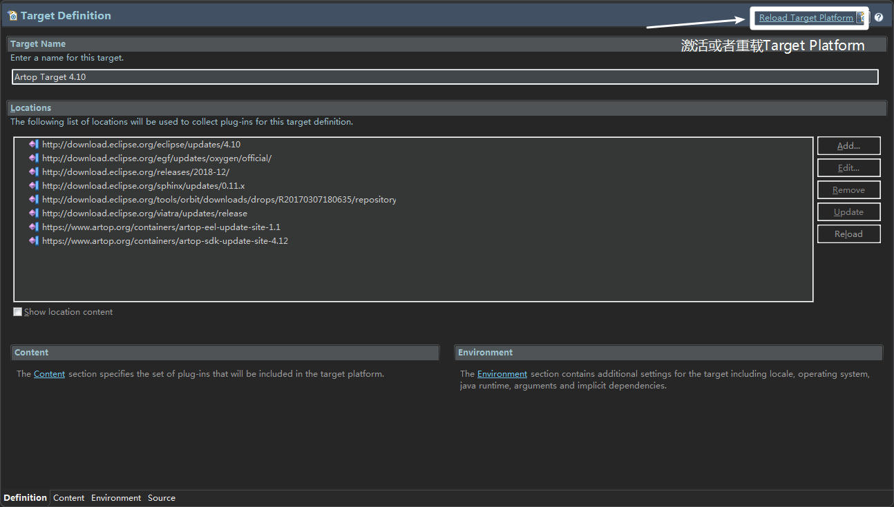

# Eclipse Target Platform Configuration

* **1.Eclipse_RCP打开artop_examples_learning目录下的target文件**

	Eclipse_RCP版本需要和target文件所指定的版本对应，如本目录下的target版本为4.10，故需要对应4.10版本（即2018-12版本）的Eclipse_RCP。

* **2.激活artop软件**

  在[artop网站](https://www.artop.org/action/Container)激活你所需要的软件，这样才能被下载。

* **3.设置Target Platform**

  RCP版本的Eclipse会自动识别target文件，接下来点击右上角的激活（第一次打开的时候）或者重载Target Platform，见下图。

  

  接下来，等待下载软件（需要输入artop账号和密码，另外可以通过设置来自定义下载的软件）

* **4.后期**

  后面即可使用该Target Platform开发Artop应用。